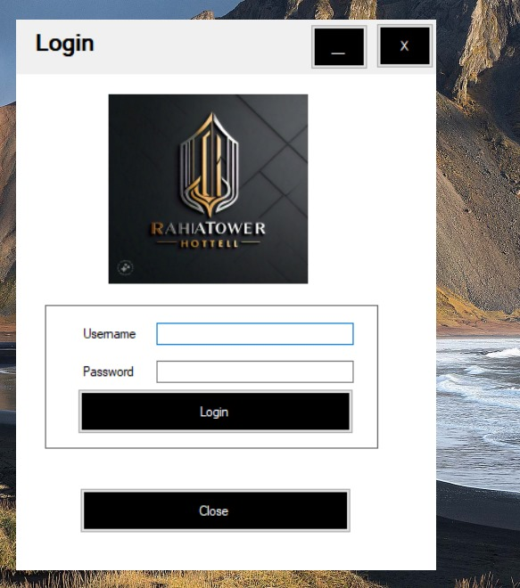
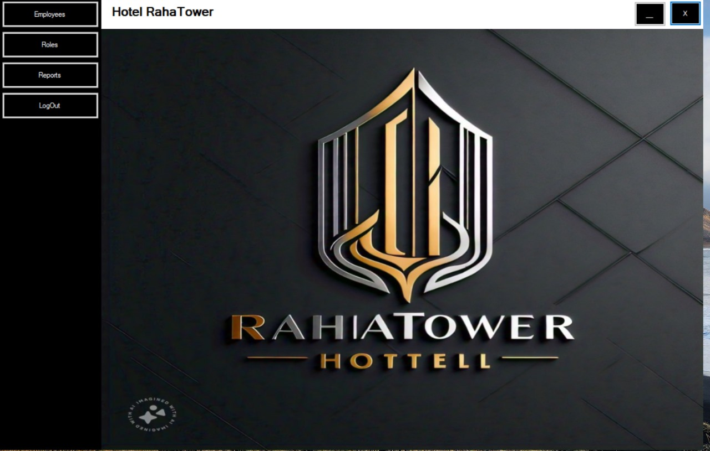
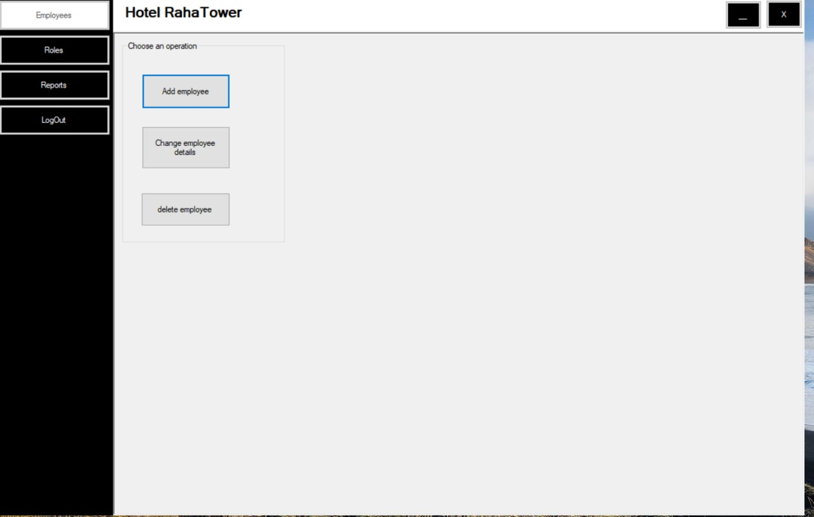
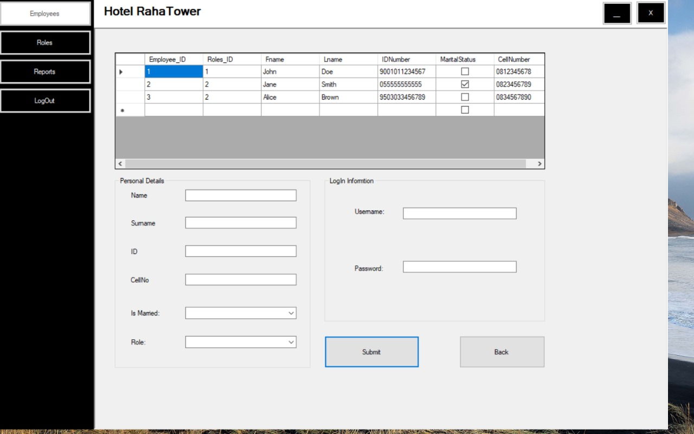
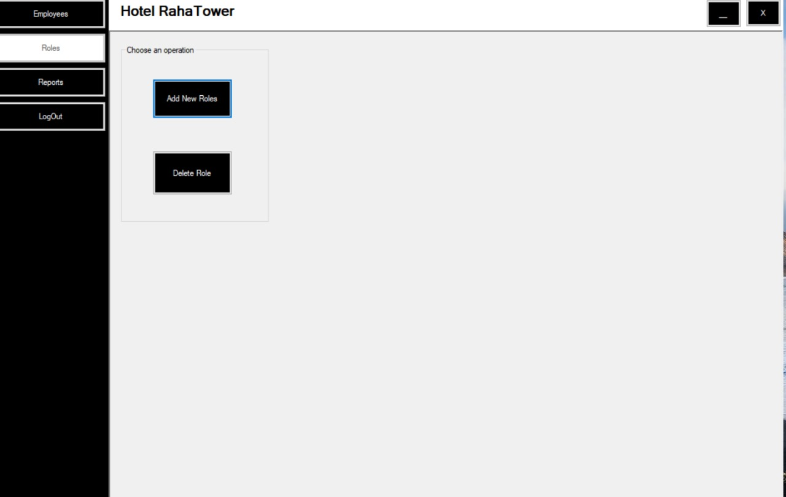
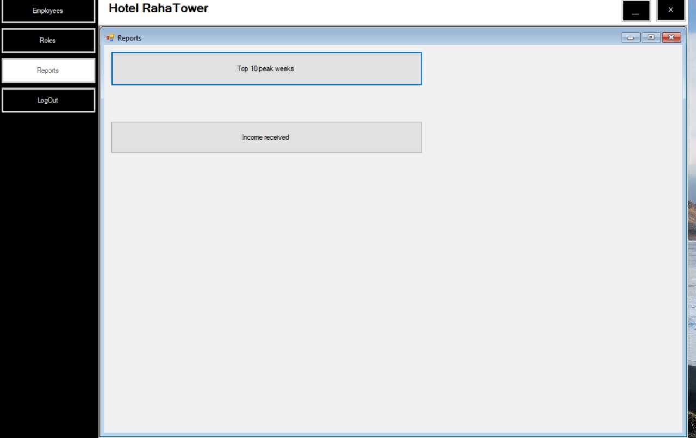
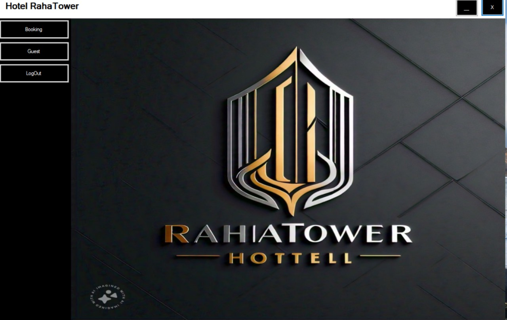
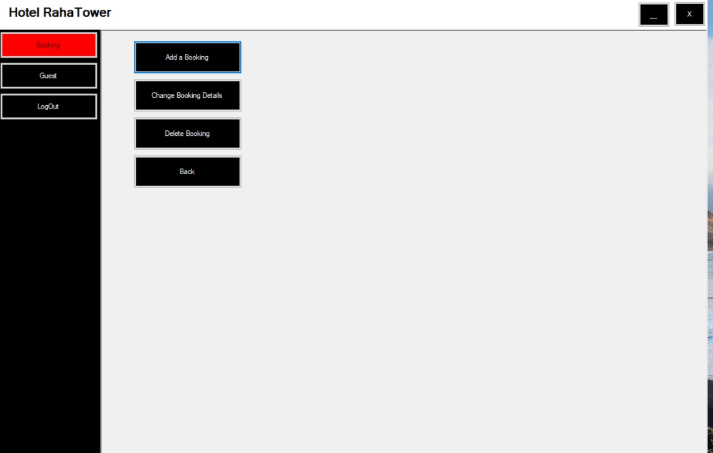
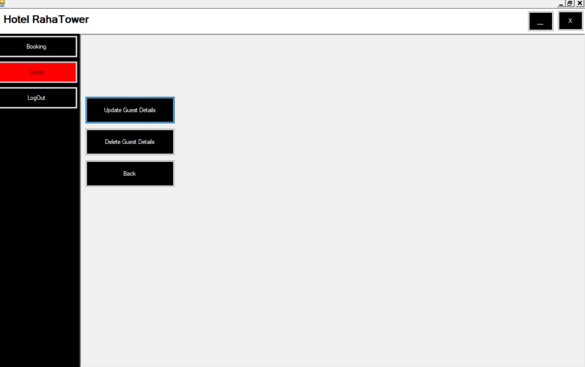

# hotel-management-system
Final version of VS hotel management system
A Windows desktop Hotel Management System developed using C# (.NET Framework) with Windows Forms (WinForms) and Oracle Database.
This application helps manage hotel operations such as room bookings, guest management, payments, and reports.

---

## 📌 Features

- ✅ Guest Registration and Profile Management  
- ✅ Room Booking and Availability Check  
- ✅ Check-in and Check-out Operations  
- ✅ Admin Dashboard with Role-Based Access  
- ✅ Occupancy and Revenue Reports  
- ✅ Secure Oracle Database Integration  
- ✅ Windows GUI for easy usability  

---

## 🛠 Technologies Used

| Layer       | Tech Stack                     |
|-------------|--------------------------------|
| Frontend    | C# WinForms (.NET Framework)   |
| Backend     | C#                             |
| Database    | Oracle                         |
| IDE         | Visual Studio                  |

## Screenshots

### Login Page  

### Dashboard s 

